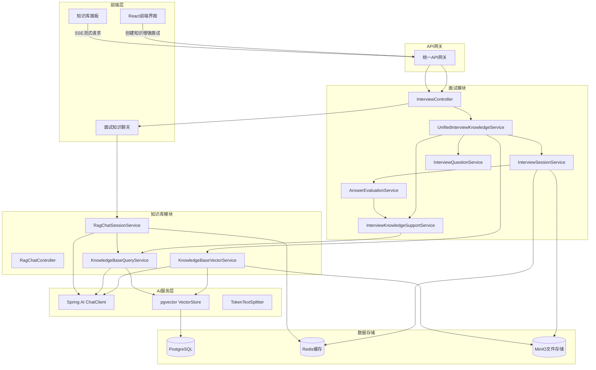
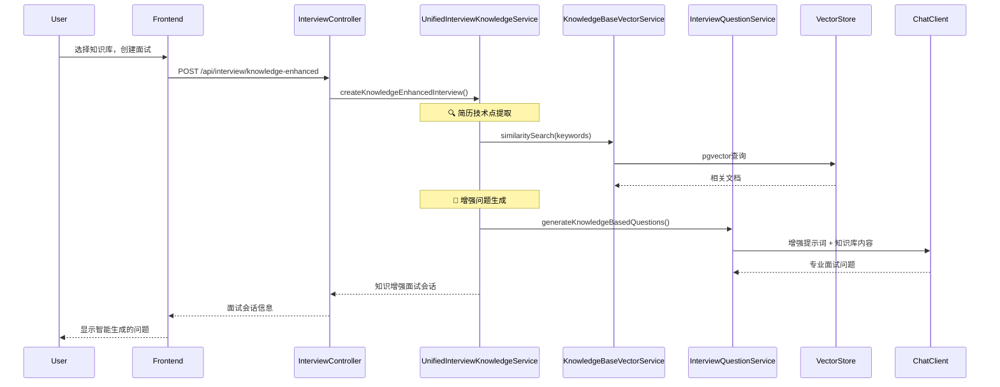
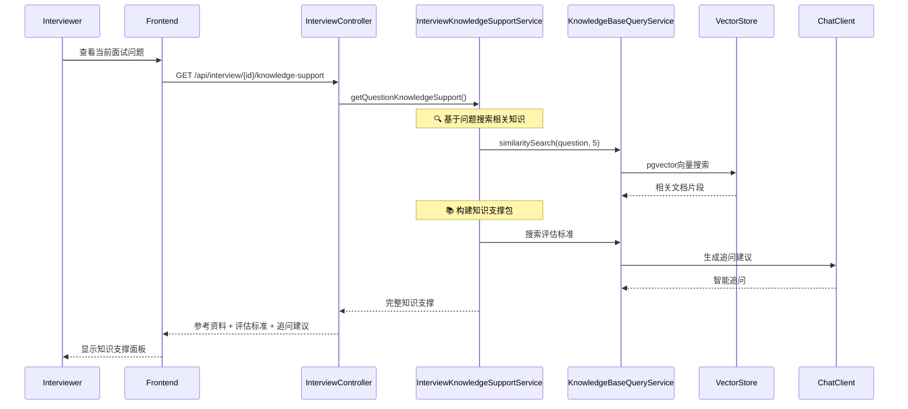
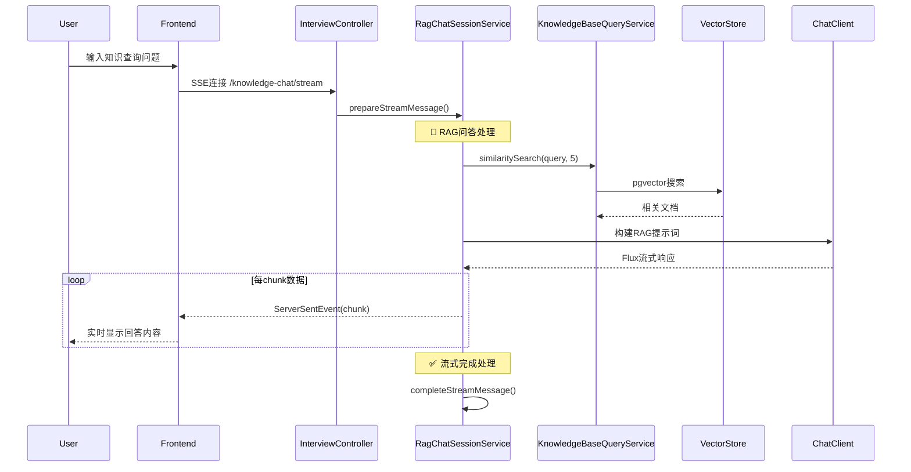
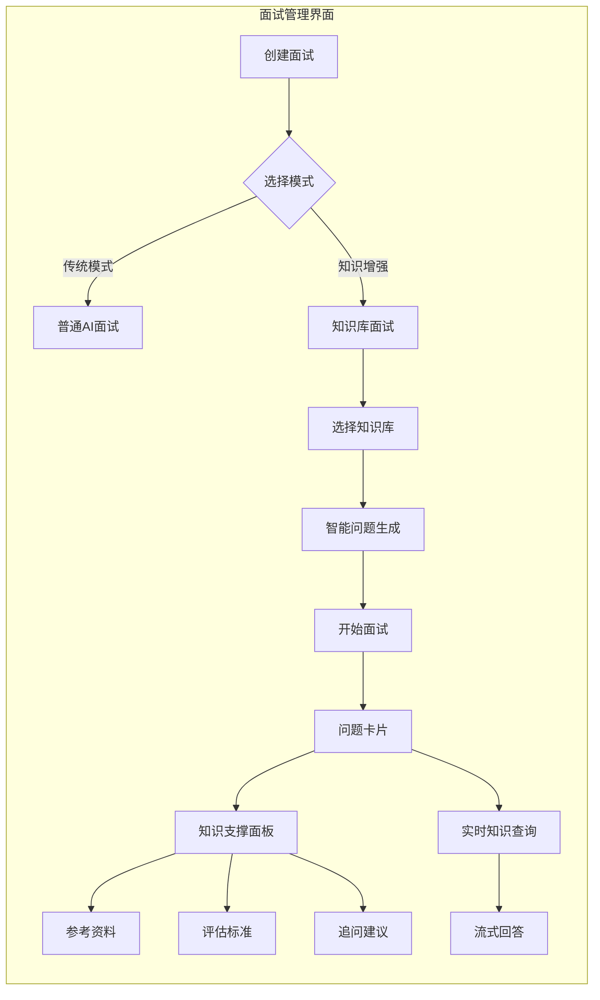
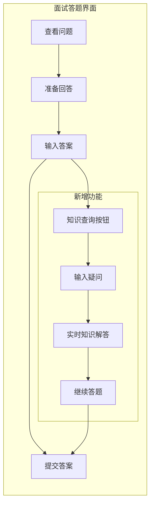

我来为你绘制完成模块打通后的完整流程图。让我先分析当前的架构，然后展示整合后的数据流。
        
            
toolName: todo_write
            
status: success
          
Todos updated: 3 items
          
## 🔄 整合后的完整流程图

### 📊 系统架构总览

### 🎯 核心数据流详解

#### 1️⃣ **智能面试创建流程**

#### 2️⃣ **实时知识支撑流程**

#### 3️⃣ **交互式知识问答流程**

### 🎨 用户界面交互流程

#### 面试官视角

#### 候选人视角

### ⚡ 技术亮点

#### 🧠 **智能问题生成**
- **技术点识别**：自动提取简历中的Spring、MySQL、Redis等关键词
- **知识匹配**：为每个技术点从知识库搜索最相关内容
- **难度分级**：基于知识库内容复杂度自动调整问题深度

#### 🔍 **精准知识搜索**
- **向量相似度**：pgvector实现语义级别的知识匹配
- **多知识库**：同时查询Java、Spring、数据库等多个专业库
- **实时更新**：知识库更新立即反映在新面试中

#### 💬 **流式交互体验**
- **SSE技术**：Server-Sent Events实现实时双向通信
- **逐字显示**：AI回答像打字一样逐字展现
- **断点续传**：网络中断自动重连，保持对话连续性

#### 📊 **数据流转优化**
- **Redis缓存**：常用知识点缓存，提升响应速度
- **异步处理**：问题生成和知识搜索并行处理
- **智能预加载**：根据用户行为预加载可能需要的知识

### 🎁 用户体验提升

| 功能模块 | 传统面试 | 知识增强面试 |
|---------|---------|-------------|
| **问题质量** | 通用AI问题 | 基于专业知识的深度问题 |
| **知识支撑** | 无 | 实时参考资料和评估标准 |
| **交互体验** | 单向问答 | 双向知识探索 |
| **学习价值** | 有限 | 边面试边学习专业知识 |
| **评估准确性** | 主观判断 | 基于专业标准的客观评估 |

这套整合方案将专业知识库与智能面试完美结合，既提升了面试质量，又为候选人和面试官提供了更好的交互体验！