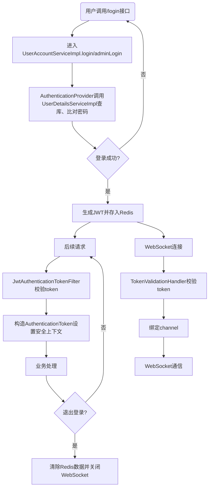

# 项目要点QA

## 总体

### 项目是做什么的？

#### 秒杀系统

主要核心在于，库存数据一致性和高并发的流量

**双层流量防御体系：**

- **入口保护：** 使用 Guava 的 **令牌桶** 算法 (`tryAcquire()` 非阻塞模式) 对接口进行单机限流，保护应用实例自身的线程资源不被耗尽。
- **下游保护：** 引入 **Kafka** 作为消息队列，实现 **削峰填谷** 和 **异步落库**，将瞬时的高并发写入转化为下游数据库可承受的恒定速率。

**原子化库存扣减：** 采用 **Redis + Lua 脚本** 对库存进行原子化操作，避免并发超卖，并利用 **MySQL 任务表** 配合定时任务，解决了 Redis 与 MySQL 之间的数据最终一致性问题。

#### 视频系统

主要核心在于，实时通信，多媒体异步处理

**实时通信核心（Netty）：** 引入 **Netty + WebSocket** 构建了高效的 IM 聊天系统，解决了传统 HTTP 轮询的延迟和性能问题，并实现了多端同步和在线状态管理。

**多媒体异步处理（FFmpeg）：** 实现了视频上传的 **OSS 分片上传与断点续传**，并将耗时的视频转码（FFmpeg + HLS 格式）流程**异步化**，通过 Kafka 投递任务，保证了用户上传体验。

### 项目亮点


## 秒杀

### 如何防止超卖的

**预扣库存：** 为了抗住高并发，我没有直接查数据库，而是将库存预热到 Redis 中。

**原子性保证：** 使用 **Lua 脚本**执行“查询+扣减”操作。因为 Redis 是单线程执行脚本的，这样能保证在检查库存和扣减库存之间不会有其他线程插入，避免了并发下的超卖问题。

**Kafka异步落库：** Redis 扣减成功后，并不直接写 MySQL，而是通过任务表记录一条任务日志（PENDING待处理）并发送消息到 Kafka。

**最终一致性： **消费者收到消息后更新 MySQL 库存。如果中间失败，我有定时任务扫描“PENDING”状态过久的任务进行重试或回滚 Redis，保证最终一致性

### 为什么选择令牌桶而不是漏桶

漏桶算法更适合平滑流量，以匀速处理请求，不适合这种秒杀场景，令牌桶更适合突发流量秒杀这种

实现方式就是Guava 的RateLimiter，基于令牌桶的算法，通过 `tryAcquire()` 非阻塞地获取令牌，拿不到令牌那当前线程**立即返回 `false`**，不会进入等待状态，代码继续往下执行。

### 引入Kafka有什么作用

削峰：令牌桶放行了高并发，但这些被放行的请求仍然是瞬间爆发的。Kafka 作为一个巨大的**异步缓冲池**，能够瞬间接收所有被放行的请求，并允许下游的消费者以一个**恒定且安全**的速率（比如每秒只处理 50 个订单）进行拉取和处理。这才是对 **MySQL 数据库**真正的削峰，因为它将瞬时的并发写入**平滑**成了长时间的均匀写入

解耦：时间上线程不需要等待数据库写入完成，缩短了响应时间；系统上即使订单服务宕机了，数据也不会丢失，因为在kafka中排队等待。

### 消息丢失怎么办

因为引入了任务表，在把消息发送给kafka之前，就现在任务表中记录状态为PENDING，消费成功的时候再修改状态

如果Kafka消息丢失了或者失败了，后台有定时任务扫描状态是PENDING的记录进行重发。

## 登录认证

### 什么是RBAC

 RBAC 也就是基于角色的权限访问控制。这是一种通过角色关联权限，角色同时又关联用户的授权的方式。

简单地说：一个用户可以拥有若干角色，每一个角色又可以被分配若干权限，这样就构造成“用户-角色-权限” 的授权模型。在这种模型中，用户与角色、角色与权限之间构成了多对多的关系。

### 什么是JWT，优势

#### 概念对比

| 概念      | 核心作用                                                     | 认证模式               |
| :-------- | :----------------------------------------------------------- | :--------------------- |
| *Cookie*  | **传输载体**，存储在客户端，用于携带少量信息，如Session ID或Token。 | 载体                   |
| *Session* | **服务器端状态存储**，用于保存用户登录状态、购物车等信息。   | **Stateful (有状态)**  |
| *JWT*     | 一种标准的Token格式，包含Header、Payload、Signature。        | **Stateless (无状态)** |

---

#### Cookie 与 Session 的关系

有状态的组合：

*   **Cookie是Session ID的载体：** 当用户首次登录成功，服务器会生成一个唯一的 **Session ID**，并将用户的状态存储在服务端。
*   **传输机制：** 服务器将这个 **Session ID** 打包成一个特殊的 **Cookie**（默认命名为 `JSESSIONID`）发送给浏览器。
*   **后续请求：** 浏览器在每次后续请求中都会自动带上这个 `JSESSIONID` Cookie。
*   **后端需要认证的处理：** Java后端通过解析这个Cookie，找到Session ID，然后**查询服务器端的存储**，恢复用户状态。

所以默认情况下，Session 是借助 Cookie 来完成身份标识的传递的，这样服务器端才能根据 Session ID 和保存的会话信息进行关联，用于找到某个具体登录的用户，所以说：**默认情况下，Session 机制是依赖 Cookie 实现的**。

**那禁用Cookie，Session就失效了？**

URL Rewriting：可以在每个请求的 URL 中附加 Session ID 参数。服务器在接收到请求时，解析 URL 中的 Session ID，并与对应的 Session 数据进行关联。这种方式适用于没有禁用地址栏中的参数传递的情况。


#### JWT 与 Cookie 的关系

无状态的组合：

- **Token 的生成：** 当用户首次登录成功，Java 后端会生成JWT字符串。
- **传输机制：** 服务器将这个完整的 **JWT 字符串** 打包成一个自定义名称的 **Cookie**（例如命名为 access_token），并通过 Set-Cookie 响应头发送给浏览器。
- **后续请求：** 浏览器在每次后续请求中，会自动带上这个包含 JWT 字符串的 Cookie。
- **后端需要认证的处理：** Java 后端通过解析这个 Cookie，取出 JWT 字符串，然后**立即进行签名校验**。如果校验通过，则直接从 JWT 的 Payload 中获取用户信息。

#### 异同与选型

Session有状态，JWT无状态。


#### 安全性

有**Signature：** 安全的核心！由 Header + Payload + 服务器的密钥通过指定的算法计算出来的加密哈希值。


JWT由这三部分组成，签名伪造不出来，所以jwt即使被人拿到了也无所谓。

#### JWT优势

**无状态**：服务端不用存储状态，存在客户端，多服务器分布式不需要考虑跨服务器问题

**避免CSRF攻击：**

**适合移动端应用：**

	状态管理: Session 基于服务器端的状态管理，而移动端应用通常是无状态的。移动设备的连接可能不稳	定或中断，因此难以维护长期的会话状态。如果使用 Session 进行身份认证，移动应用需要频繁地与服	务器进行会话维护，增加了网络开销和复杂性;
	
	兼容性: 移动端应用通常会面向多个平台，如 iOS、Android 和 Web。每个平台对于 Session 的管理和存	储方式可能不同，可能导致跨平台兼容性的问题

### 整个的登录流程

#### 流程图




#### Security

1.**SecurityFilterChain**

建立整个安全网关与过滤器顺序

谁能进谁不能进

2.**PasswordEncoder**

BCrypt加密密码

3.**AuthenticationProvider**（执行者）

作用：

- 调用 UserDetailsServiceImpl 加载用户详情
- 用 PasswordEncoder 做密码匹配-->成功则返回带 principal=UserDetailsImpl 的 Authentication。

4.**UserDetailsServiceImpl**

把SQL的用户信息封成UserDetailsImpl

作用：

- 过滤不可用状态
- 返回 UserDetailsImpl给 3

5.**UserDetailsImpl**

作用：

- 登录认证成功后作为 principal 返回
- 过滤器校验通过后，用它包住用户快照放入 SecurityContextHolder

6.**JwtAuthenticationTokenFilter**

HTTP 请求的 JWT 认证入口

作用：

- 从请求头解析 Authorization: Bearer .
- 用 JwtUtil.verifyToken 验签并校对服务端缓存（Redis）

7.**SecurityContextHolder**

保存当前线程的认证上下文

作用：

- 被 JwtAuthenticationTokenFilter 写入（请求开始时还原登录态）。

- 被业务层通过工具类（如 CurrentUser）读取（无需再次解析 token）。

#### 登录流程

总结一下过程

最开始，用户登录接口**触发**了-->

``` java
  UsernamePasswordAuthenticationToken authenticationToken =new UsernamePasswordAuthenticationToken(username, password);
authenticate = authenticationProvider.authenticate(authenticationToken);//给执行者令牌
```

（接口）执行者封装认证Token（是Spring Security的认证令牌，不是JWT token），封装完之后把**令牌**传给执行者的authenticate验证方法-->

（执行者）**验证方法**调用UserDetailsServiceImpl通过用户名查数据库，**返回 UserDetailsImpl 对象**包括用户信息和加密后的密码-->

（执行者）**验证方法**使用 BCryptPasswordEncoder.matches() **比较**密码和数据库对不对-->

（接口）不对，抛出异常；

（接口）对，取出来UserDetailsImpl 对象作为Principal，接着就是给前端

```  java
UserDetailsImpl loginUser = (UserDetailsImpl) authenticate.getPrincipal();
```

（接口）通过这个**principal**，接口拿到数据-->

（接口）调用 JwtUtil的的方法生成JWT 令牌-->

（接口）正式写入两个 Redis 键：

- token:user:{uid} - 存储完整的 JWT 令牌

- security:user:{uid} - 存储用户信息快照-->

``` java
redisUtil.setExObjectValue("security:user:" + user.getUid(), user, 60L * 60 * 24 * 2, TimeUnit.SECONDS);//用户快照
 redisUtil.setExValue("token:" + role + ":" + uid, token, JwtUtil.JWT_TTL, TimeUnit.MILLISECONDS);//jwt
```

最后返回 JWT 令牌给前端，返回用户基本信息（DTO）前端收到后保存令牌，后续请求携带

**!!!精简版：**接口触发→执行者封装Token（是Security的令牌不是JWT）→验证的方法查数据库拿UserDetailsImpl →比较账号密码→接口拿UserDetailsImpl →生成jwt令牌→返回给前端

#### 后续认证流程

用户访问受保护接口时，请求头携带 Authorization: Bearer {token}-->

JwtAuthenticationTokenFilter 过滤器拦下所有请求，检查请求头是否有 Authorization 且以 Bearer 开头

- 如果没有，直接放行（可能是公开接口）

- 如果有，提取令牌部分

调用JwtUtil，token比对

#### 对无状态体系的优化

| **面试官问题 (Q)**                                           | **核心回答要点 (A)**                                         |
| ------------------------------------------------------------ | ------------------------------------------------------------ |
| **Q:** **JWT 是如何保证安全性的？** 如果 Token 被盗用，您如何处理？ | A: <br />1. 安全保障： 主要依靠 签名 (Signature)。服务器使用密钥对 Token 进行签名，防止内容被篡改。同时必须配合 HTTPS 传输防止窃听。<br /> 2. 盗用处理与优化：    <br />短生命周期 (Access Token)： 设置 15-30 分钟的短有效期，降低盗用风险。    <br />刷新机制 (Refresh Token)： 引入长效的 Refresh Token 负责续期。它应安全地存放于 HttpOnly Cookie，有效防止 XSS 攻击。   <br /> 主动注销 (黑名单)： 针对强制注销等需求，将 Access Token 的 JTI (唯一ID) 加入 Redis 黑名单，实现即时作废，弥补纯无状态体系无法主动失效的缺陷。 |
| **Q:** 提到 Redis 黑名单，这是否与 **JWT 的无状态性** 矛盾？ | **A:** **不矛盾，这是安全与性能的权衡。<br />**  **无状态 (本质)：** 服务器**不存储**所有活跃用户的会话状态 (Session)。<br />  **黑名单 (优化)：** 引入 Redis 仅是为了存储**少数需要强制作废的 Token ID**。它只是一种安全**补救措施**，而非存储全部会话，因此整体架构仍属于 **无状态体系**。 |


### 密码加密的方式

**BCrypt**的优势：自动加盐，每次加密即使密码相同，生成的hash值也是完全不同的。spring Security的`PasswordEncoder`默认就是这种方式

MD5的缺陷：MD5是固定的哈希算法，容易被彩虹表破解

	**彩虹表：**攻击者事先将大量的*明文密码*及其对应的 *哈希值*（例如 MD5 或 SHA-1 的哈希值）计算出来，并存储在一个巨大的表中。这个就是彩虹表。
	
	**加盐：** “盐”是一个**随机生成**的、长度足够的字符串或字节序列。它不是用户密码的一部分，而是专门为哈希过程创建的。![盐格式]


## Redis和ES

### Redis缓存什么

#### 用户信息缓存

``` java
//将uid封装成一个jwttoken，同时token也会被缓存到redis中
        String token = jwtUtil.createToken(user.getUid().toString(), "user");

        try {
            // 把完整的用户信息存入redis，时间跟token一样，注意单位
            // 这里缓存的user信息建议只供读取uid用，其中的状态等非静态数据可能不准，所以 redis另外存值
            redisUtil.setExObjectValue("security:user:" + user.getUid(), user, 60L * 60 * 24 * 2, TimeUnit.SECONDS);
            // 将该用户放到redis中在线集合
//            redisUtil.addMember("login_member", user.getUid());
        } catch (Exception e) {
            log.error("存储redis数据失败");
            throw e;
        }
```

想当于用户快照

#### 视频信息缓存

```java
 	CompletableFuture.runAsync(() -> redisUtil.setExObjectValue("video:" + video.getVid(), video), taskExecutor);
    CompletableFuture.runAsync(() -> redisUtil.addMember("video_status:0", video.getVid()), taskExecutor);
    CompletableFuture.runAsync(() -> redisUtil.setExObjectValue("videoStats:" + video.getVid(), videoStats), taskExecutor);
```

### Redis怎么部署的

在我目前的个人项目中，为了快速开发和验证想法，我是在本地直接运行了一个单实例的Redis服务。但是，我非常清楚这种单机模式在生产环境下是有**单点故障**风险的。

如果这个项目要上线，我会根据业务体量和可用性要求来选择部署方案：

中小型项目中，我会采用哨兵模式，部署一主两从三哨兵，这是性价比很高的高可用方案。

如果预期会有海量数据和高并发，我会直接采用 Redis Cluster集群模式，通过分片来实现横向扩展。

我理解它们各自的原理和适用场景，只是目前个人项目阶段还没有实际部署集群的必要。

**常见的部署模式：**

1. **单机模式**：开发环境常用，生产环境不推荐，有单点故障风险。
2. **主从复制 (Master-Slave)**：一主多从，主负责写，从负责读。实现了读写分离和数据备份，但主节点宕机需要**手动**切换。
3. **哨兵模式 (Sentinel)**：在主从基础上，增加了哨兵进程来监控主从节点。当主节点宕机时，哨兵可以**自动**完成故障转移和主从切换，实现**高可用**。这是中小型项目中非常经典的架构。
4. **集群模式 (Cluster)**：采用无中心结构，通过分片（Sharding）来进行数据存储，可实现海量数据存储和高并发。具备高可用和可扩展性，是大型项目的选择。

### ES原理

#### 查询方式

##### 正向


如果是根据id查询，那么直接走索引，查询速度非常快。

但如果是基于title做模糊查询，只能是逐行扫描数据

数据量爆大，直接炸了

##### 倒排

两个核心概念

- 文档（`Document`）：用来搜索的数据，其中的**每一条数据就是一个文档**。例如一个网页、一个商品信息
- 词条（`Term`）：对文档数据或用户搜索数据，利用某种算法分词，得到的具备含义的词语就是词条。例如：我是中国人，就可以分为：**我、是、中国人、中国、国人这样的几个词条**


把重合的词条提出来建新的表


查询过程

#### Elasticsearch 的数据库样式

Json格式，通过转换器等转换成倒排索引

### ES数据同步

##### 全量同步

对建好 Elasticsearch 索引后一次性导入 MySQL 所有数据

##### 增量同步

对 MySQL 中新增，修改，删除的数据进行同步

- 同步双写 ：修改数据时同步到 Elasticsearch。这种方式性能较差、存在丢数据风险且会耦合大量数据同步代码，一般不会使用。
- 异步双写 ：修改数据时，使用 MQ 异步写入 Elasticsearch 提高效率。这种方式引入了新的组件和服务，增加了系统整体复杂性。
- binlog 同步组件 Canal(推荐) ： 使用 Canal 可以做到业务代码完全解耦，API 完全解耦，零代码实现准实时同步, Canal 通过解析 MySQL 的 binlog 日志文件进行数据同步

### ZSet实现排行榜

**1、**首先是加入搜索词的时候，带有热度属性，热度默认值是1

``` java
  public String addSearchWord(String text) {
        // 处理传入的内容 去除特殊字符
        String formattedString = formatString(text);
        // 如果格式化后的字符串没有任何中英日文或数字，直接返回null
        if (formattedString.length() == 0) return null;
        // 判断剩余中英日文是否达到可存为关键词的长度
        int keywordLength = countChineseAndLetters(formattedString);
        // 如果长度不符合就直接返回格式化字符串，不存redis和ES
        if (keywordLength < 2 || keywordLength > 30) return formattedString;
        // 查询数据库中是否有该词条，用异步线程不耽误后面查询
        CompletableFuture.runAsync(() -> {
            if (redisUtil.zsetExist("search_word", formattedString)) {
                // 如果有，就热度加一
                redisUtil.zincrby("search_word", formattedString, 1);
            } else {
                // 否则添加成员到redis和ES
                redisUtil.zsetWithScore("search_word", formattedString, 1);
                esUtil.addSearchWord(formattedString);
            }
        }, taskExecutor);
```

代码逻辑是如果有就在Redis的Zset热度+1，如果没有，就在es和redis中都添加一份就行，这里是职责分离，也就是es只存关键词本身，redis存储热度值+关键词都有。

**2、**在搜索的时候，获取热度排序

``` java
public List<HotSearch> getHotSearch() {
        List<RedisUtil.ZObjScore> curr = redisUtil.zReverangeWithScores("search_word", 0, 9);
        List<HotSearch> list = new ArrayList<>();
        for (RedisUtil.ZObjScore o : curr) {
            HotSearch word = new HotSearch();
            word.setContent(o.getMember().toString());
            word.setScore(o.getScore());
            Double lastScore = findScoreForName(o.getMember());
            if (lastScore == null) {
                word.setType(1);    // 没有找到就是新词条
                if (o.getScore() > 3) {
                    word.setType(2);    // 短时间内搜索超过3次就是热词条
                }
            } else if (o.getScore() - lastScore > 3) {
                word.setType(2);    // 短时间内搜索超过3次就是热词条
            }
            list.add(word);
        }
        return list;
```

是拿前0-9的热度数据，然后进行判断他们的type也就是是否热


## CompletableFuture 异步

### 线程池是什么

顾名思义就是，管理一些线程的资源池，提供限制和管理资源的方式，维护一些基本信息。

#### 没有线程池vs有线程池

**最大线程数、拒绝策略：**在高并发下，可能瞬间创建过多线程，导致崩溃---**最大线程数限制并发量、拒绝策略**

**阻塞队列：**所有任务都直接启动新线程执行---**多余任务到阻塞队列削峰**

**核心线程数**：任务完成就销毁，任务都要创建---重复利用，上下文无开销

**Future、join等：**不能实现扩展功能---丰富。支持 `submit` (带返回值 `Future`)、`schedule` (定时/周期性任务)。

### Executor框架

Java5后面引进的一种框架，有队列，拒绝策略等东西

由三部分组成：

任务Task：定义做什么 Runnable不返回结果、Callable返回结果可抛异常

任务的执行Executor（ThreadPoolExecutor关键类继承于此）：谁来做怎么做

异步计算的结果Future：如何获取结果

运行流程：

1. 先决定用Runnable、Callable哪个接口
2. 通过调用 ExecutorService 的 submit() 方法来**提交任务**，具体的执行则由其实现类（如 ThreadPoolExecutor）来完成。
3. 给一个结果Future，可以主进程干别的
4. 获取结果Future.get，计算完成直接取走，计算未完成线程堵塞

### ThreadPoolExecutor

#### 核心参数


`ThreadPoolExecutor` 3 个最重要的参数：

- `corePoolSize`：核心线程数：线程池中保持活动状态的线程数量，即使是空闲的（常驻店员）
- `maximumPoolSize`：最大线程数：线程池能够容纳同时执行的最大线程数（常驻店员+临时工最大值）只有workQueue和corePoolSize都满了时候才招临时
- `workQueue`：用于保存等待执行任务的阻塞队列（等候区）

`ThreadPoolExecutor`其他常见参数 :

- `unit` : `keepAliveTime` 参数的时间单位。
- `keepAliveTime`:非核心线程在没有作业的时候的等待时间
- `threadFactory` :用于创建新线程，可以用它来为线程池中的线程命名。
- `handler` :拒绝策略：当任务队列已满且线程数达到maximumPoolSize时，用于处理新提交任务的策略。

#### 参数的优化

**CPU密集型任务：**任务的大部分时间都用在计算上，例如：复杂的数学运算、数据分析、加密/解密、大量循环等。它们需要 CPU 持续工作，I/O 操作相对较少。

**核心线程数=CPU核心数+1**

**I/O 密集型任务：**任务的大部分时间都花在等待 I/O 操作完成上，例如：**数据库操作**（查询、更新）、**网络请求**（HTTP API 调用）、**文件读写**等。当一个线程发起 I/O 请求后，它会阻塞，释放 CPU 资源。

线程数必须远大于 CPU 核心数，以补偿那些因等待 I/O 而阻塞的线程，确保 CPU 始终有活干。

**核心线程数=CPU核心数*（1+等待时间/运行时间）**

| **特性**     | **CPU 密集型**               | **I/O 密集型**               |
| ------------ | ---------------------------- | ---------------------------- |
| **主要耗时** | 计算 (CPU)                   | 等待 (I/O 阻塞)              |
| **核心问题** | 上下文切换的开销             | CPU 在 I/O 等待期闲置        |
| **优化策略** | **限制线程数**，减少切换开销 | **增加线程数**，覆盖阻塞时间 |

#### 线程的生命周期


#### 线程池的创建

在Java线程池模式下，我们**不直接通过`new Thread()`来创建线程**，而是通过**配置一个执行器（`ThreadPoolExecutor`）**，让它在内部机制驱动下创建和管理线程。

1. **真正的创建者是`ThreadFactory`：** 线程池内部是通过一个叫做**`ThreadFactory`**的接口来创建新的线程对象的。这是我们唯一能干预线程创建细节的入口。
2. **创建的条件：**由**`corePoolSize`**和**`maximumPoolSize`**参数控制的。例如，当新任务到达，且当前工作线程数小于`corePoolSize`时，线程池就会通过`ThreadFactory`创建一个新的**核心线程**来执行任务。”
3. **怎么使用：**如果用`@Async("taskExecutor")` 或者使用`CompletableFuture.runAsync(..., taskExecutor)`的时候，才接入自定义的线程池，其他时候都是使用的spring内置的线程池

一、通过ThreadPoolExecutor 构造函数创建

看上面。

二、通过 Executors 工具类创建（不推荐）

Executors提供了几个常用的静态方法创建线程池：

- **Executors.newFixedThreadPool(int nThreads)**: 创建一个固定大小的线程池。
- **Executors.newSingleThreadExecutor()**: 创建一个只有一个线程的线程池。
- **Executors.newCachedThreadPool()**: 创建一个可缓存的线程池，线程数根据任务量动态调整。
- **Executors.newScheduledThreadPool(int corePoolSize)**: 创建一个可以执行定时任务的线程池。[[11](https://www.google.com/url?sa=E&q=https%3A%2F%2Fvertexaisearch.cloud.google.com%2Fgrounding-api-redirect%2FAUZIYQG2IiFdBMp54fCEUJpn5fOo7ZMmKQoq7kZMgMK03czL60qvjlQjd4-eCNwZELuQsNTKPJsCh2wr12GFMUrpV42f76OrPRjFktmnolBF0GJbWgl3OBMWz58krvspCeZfUIZQbokD)]

为什么不推荐用Executors 创建

- 前两个：使用了无界的LinkedBlockingQueue作为任务队列。如果任务的生产速度远快于消费速度，队列中的任务会持续堆积，最终可能导致服务器内存溢出（OOM）。
- 后两个：允许创建的线程数量几乎是无限的。当有大量并发请求时，它会不断创建新线程，这可能耗尽CPU和内存资源，导致系统崩溃。 


#### 线程池的工作过程


#### 线程池的拒绝策略

**CallerRunsPolicy**, 使用线程池的调用者所在的线程去执行被拒绝的任务，除非线程池被停止或者线程池的任务队列已有空缺。

**AbortPolicy**, 直接抛出干不了的异常

**DiscardPolicy**, 不做任何处理，静默拒绝提交的任务。

**DiscardOldestPolicy**, 抛弃最老的任务，然后执行该任务。

还有自定义拒绝方式

### CompletableFuture

为什么不用Future本身了呢？虽然他可以异步计算，但是获取结果的时候必须使用`Future.get()`的方式阻塞调用线程，或者轮询询问是否完成。

我的项目创建CompletableFuture使用的是通过自定义线程池，根据runnable构建执行任务。也就是下面这种

```java
ompletableFuture.runAsync(() -> {
    redisUtil.zset("user_video_history:" + uid, vid);   // 添加到/更新观看历史记录
    videoStatsService.updateStats(vid, "play", true, 1);
}, taskExecutor);
```

而不是使用了默认内置线程池`ForkJoinPool.commonPool()`，因为这个线程池的处理线程数量是电脑的CPU核数-1，不如自定义

1.有并行加载数据的，比如同时加载用户信息和视频信息，加快加载速度

> 比如这个**场景：** 视频详情页加载时，需要聚合三个独立的数据源：1. 视频基本信息（MySQL），2. 用户信息（User Service），3. 统计数据（点赞/播放量）。
>
> **优化：** 如果串行执行，耗时是 T1+T2+T3。使用 `CompletableFuture`，我可以让 T2 和 T3 **并行执行**，最终通过 `join()` 等待结果合并。这极大地降低了接口响应时间（RT），提升了用户体验。

2.有异步通知消息的，就是如果有人点赞了异步去通知，作用就是用户不需要等结果，还有就是网络IO发消息这种操作也是比较耗时间的，异步不会堵塞主线程。

3.有异步缓存更新的，符合读写分离这种设计理念

实际使用上，项目在：

1. 并行加载：聊天系统同时加载聊天记录和用户资料
2. 异步通知：异步通知消息的，就是如果有人点赞了异步去通知
3. 异步更新：除了缓存写的时候，还有就是在于更新视频到OSS上


## Netty&WebSocket

项目的实时通信就是基于Netty实现的。以下是Netty部分的笔记：

### IO模型相关

首先说NIO


BIO：同步阻塞 IO （个人理解就是悲观锁）--数据的读写必须堵塞在一个线程里进行
NIO： 同步非阻塞--- read调用之后如果没准备好不断轮询，询问内核准没准备好
配合多路复用：用户线程调用select，阻塞进程。内核同时检测上万个链接，有准备就绪的就返回，用户线程收到通知之后，发起真正的read调用

> 如果只有 NIO 没有多路复用：
> 你得写个死循环，不停地问每一个 Socket：“你有数据吗？”（这叫 用户态轮询）。
>
> 代价： 1000 个连接你就要问 1000 次，CPU 还没干活就先被你问累死了。
>
> 当 NIO 配合多路复用（即 Selector）：
> 你只需要问操作系统内核一次：“这 1000 个连接里，谁有数据了？” 内核会直接告诉你具体的编号。
>
> 代价： 只发起一次系统调用，CPU 效率极高。

> 例如你有1000个IO操作，如果使用NIO，是1000个线程反复调用read。如果使用多路复用，可以1个线程反复调用select，在数据就绪后，再调用read。还是能节约资源的

AIO：异步非阻塞，就是NIO2代，基于事件和回调机制

**Netty是什么？**Netty是一个基于NIO的CS框架，可以快速简单的开发网络应用程序；简化了TCP和UDP套接字服务器等网络编程。

**应用场景**

首先就是常用的框架比如RocketMQ、Elasticsearch

实现自己的HTTP服务器，类Tomcat

可以自己实现一个实时通信系统，我的项目就是基于Netty实现的通信

### Netty的各组成部分

1、Channel：通道，所有数据的操作以及状态变更都在这个通道上，**每个用户的WebSocket连接就是一个Channel。**

2、EventLoop:事件循环，单线程执行器负责处理一个或多个Channel上的所有I/O事件，永不停止。

```markdown
单线程处理多个Channel：IO多路复用，同redis的单线程监听的大量客户端连接，也就是NIO
永不停止：也就是说一直循环等待，永远不停止，只要有被分配到他头上的	Channel来了操作，就是他来执行。
```

3、EventLoopGroup：事件循环组，一组事件循环的集合，用来管理和分配，项目中有BOSS和WORKER这两个

​	BOSS：专门负责在门口接客（`Accept` 连接）。也就是只管连接

​	WORKER：负责客人的所有具体需求（`Read` 数据、`Write` 数据、业务逻辑）。也就是处理IO

4、Pipeline：通道管道，是依附在Channel上的处理器链，也就是责任链模式的工作机制

### Netty运行流程

（详细见实时通信的实现逻辑）

(入站)**客户端发消息，服务器收消息**:**WebSocketHandler**+**ChatHandler**+**IMServer**

> IMServer：
>
> 客户端发起WebSocket连接到端口
>
> Boss接受连接，创建Channel
>
> Boss将这个新的Channel注册到work上的一个EventLoop上
>
> 开始执行这个Channel上的**Pipeline**处理数据

1. 读取过来责任链传过来的数据

2. JSON 反序列化成对象，并且再次拿到UserId封装到里面

3. 持久化数据：

   1. ``` java
      chatDetailedMapper.insert(chatDetailed);完整存
      redisUtil.zset("chat_detailed_zset")消息id缓存
      chatService.updateChat;会话状态更新
      ```

4. 准备推送数据：

   1. ``` java
      CompletableFuture.runAsync(() -> {聊天信息 chat 和发送者信息 user}, taskExecutor);
      ```

5. 推送数据：

   1. 获取发送者自己的Channel集合（多端同步）
   2. 获取接收者所有的Channel集合（消息转发）
   3. 出站：推送消息到对应的EventLoop上，启动出站Pipeline
      `for (Channel channel : from) { channel.writeAndFlush(IMResponse.message("whisper", map)); }`	

---

(出站)**服务端发消息，客户端收消息：WebSocketHandler**

1. 业务触发：定位到目标用户的**全部在线 Channel**。
2. 写入数据：承接上面的推送`writeAndFlush()`
3. 启动出站Pipeline流：消息从 Pipeline 的**尾部**（靠近应用层）开始向前（靠近网络层）流动，执行**出站处理器**。
4. 编码：IMResponse 对象编码-->WebSocketFrame 转换为网络可传输的原始字节流。
5. 发送：EventLoop 线程将这些字节流写入操作系统的 **Socket 发送缓冲区**，数据通过网络发送给客户端。

> 触发时机：聊天消息推送触发，评论通知推送，点赞通知推送

---

**总结：**

整个过程是围绕 **EventLoop** 和 **Pipeline** 循环往复：

- **收消息（入站）：** EventLoop 读数据 → Pipeline 从头到尾处理（解码、认证、业务）。
- **发消息（出站）：** 业务逻辑触发 → Pipeline 从尾到头处理（业务编码、协议编码） → EventLoop 写数据。

###  什么是心跳机制

说心跳机制先说一下 **TCP长连接和短连接**

长连接就是在S和C之间建立连接一直持续，短连接就是读写完成之后就关闭连接

为什么需要心跳机制？

在长连接的情况下，如果一方断开连接了，CS之间没有交互的话，是不知道对方已经断开了的，所以引入心跳机制：

如果处于Idle状态（连接但无交互），C或S会发送一个特殊的数据包给对方，接收方接收到这个特殊数据报文，也返回一个特殊的数据报文，这就是一个PING-PONG 交互。

Netty的**心跳机制**

TCP本身有心跳机制，但是不太灵活，所以一般在应用层实现，对应到Netty就是核心类`IdleStateHandler`

### Netty+WebSocket优势

使用的方案是Netty+WebSocket

**Netty的优势：**因为Netty是基于NIO的框架，解决了Java的NIO编程的各种麻烦，比如TCP UDP套接字之类的，Bug多编程复杂

**WebSocket的优势：**全双工协议，速度快延迟低

### 用户在线状态怎么实现的

使用了一个`ConcurrentHashMap`存储用户ID和Channel的映射，用户登录（握手）时绑定，断开时移除

## OSS断点续传

### OSS&CDN

**分片上传的原理**

因为网络数据传输的本质是一串01字节，所以可以分片。

根据格式大小等生成一个唯一标识，这个唯一标识可以用来定位视频本身。

客户端来切割（给分片序号），服务器来合并（按照序号来合）。

**断点续传的原理**

根据拿着唯一标识找进度，服务器返回进度，然后客户端就可以直接接着传下一段。

秒传就是在断点续传的基础上判断是否传完了，传完了就返回成功 了

### FFmpeg&HLS

#### 前情提要

视频编码：H.264将原始像素点压缩成码流

音频编码：AAV、MP3等将原始波形压缩

传输协议：HLS、RTMP规定怎么传输

#### FFmpeg

**1、功能**

格式转换：转换视频格式

解码编码：把原始的像素数据压缩成h.264或者反过来

流媒体处理：直播推流拉流

后期：添加水印、裁切、旋转

**2、逻辑**

分离：把文件分离出来视频流、音频流、字幕流之类的

解码：把压缩的编码数据h.264还原成像素数据或者音频数据

处理：....

编码：把处理后的数据在编码成h.264等

最后打包到目标容器里比如output.mkv


#### HLS

**1、核心部分**

m3u8索引文件：一个UTF-8编码的文本文件，记录了每个切片的时长、顺序、url路径

ts传输流文件：实际的音视频片段，通常2-10s一段

**2、逻辑**

播放器拿到`.m3u8` 

浏览器下载`.m3u8` ，读取前几个`.ts`片段

#### 修改方案

采取最小化修改方案：双url+kafka解耦转码

> ```cmd
>ffmpeg -i input.mp4 -vf "scale=1920:1080" -c:v h264 -c:a aac -f hls -hls_time 10 -hls_list_size 0 -hls_segment_filename "output/output_%03d.ts" output/output.m3u8
> ```
> 
> - `-i input.mp4`：指定输入视频文件。
>- `-vf "scale=1280:720"`：指定视频输出分辨率。
> - `-c:v h264 -c:a aac`：指定视频和音频编解码器。
> - `-f hls`：指定输出格式为 HLS。
> - `-hls_time 10`：指定每个分段的时长（单位秒）。
> - `-hls_list_size 0`：指定m3u8索引文件中包含所有分段文件。
> - `-hls_segment_filename "output_%03d.ts"`：指定分段文件的命名规则。
> 
> 运行此命令后，将生成一个`.m3u8`索引文件以及一系列的`.ts`分段文件。

#### *业务的修改*

##### （其他）新增DTO

TranscodeTask：参数是hash 和 originalOssPath，用于kafka消费者和生产者之间传输

##### （上传）**上传OSS的修改**

``` java
/*以前直接返回*/
//return OSS_BUCKET_URL + filePathName;
/*现在的判断*/
        //MP4url路径
        String originOssUrl = OSS_BUCKET_URL + filePathName;
        //转码FFmpeg
        try{
            TranscodeTask task=new TranscodeTask(hash,originOssUrl);
            kafkaTemplate.send("video_transcode_topic",task);
            log.info("已发送转码任务到Kafka，hash：{}",hash);

        }catch (Exception e){
            log.error("转码任务失败",e);
        }
        //备选方案，即使失败也要能播放mp4
        return originOssUrl;

    }
```

##### **（播放）播放接口做修改**

之前是直接取ossurl，现在是判断转码状态，如果转码成功，返回转码后的hlsurl，最后用mp4url做保底

##### **（上传）Consumer接受转码结果**

监听Kafka是否转码成功：接收到**最终URL**之后，更新`status`和`url`

``` java
// Spring Boot 业务服务中的另一个 Consumer
@Service
public class TranscodeResultConsumer {

    @KafkaListener(topics = "video_transcode_success_topic", groupId = "result-group")
    public void handleSuccess(TranscodeResult result) {
        // 1. 查询视频记录
        // 2. 更新数据库：状态为 READY_TO_PLAY，播放URL为 result.getCdnUrl()
        // videoService.updateVideoStatusAndUrl(result.getVideoHash(), VideoStatus.READY_TO_PLAY, result.getCdnUrl());
        
        // 3. (可选) 通知前端/用户
    }
    
    // ... 监听失败 topic 的方法
}
```


#### *转码的实现*

##### **（上传）ThreadPoolConfig**

为什么不用原来的线程池，是因为

##### **（上传）FFmpeg转码操作**

``` java
@Service
public class TranscodeConsumerService {
    
    @Resource(name = "ffmpegThreadPool")
    private ThreadPoolExecutor ffmpegThreadPool; // 专用于执行 CPU 密集型任务
    
    @Resource
    private OssClient ossClient; // 用于下载原始文件和上传 HLS 文件
    
    @Resource
    private KafkaTemplate<String, Object> kafkaTemplate; // 用于发送成功/失败通知
    
    private final String HLS_OUTPUT_BUCKET_PREFIX = "hls-videos/";
    
    @KafkaListener(topics = "video_transcode_topic", groupId = "ffmpeg-group")
    public void listenForTranscodeTask(TranscodeTask task) {
        // 提交到专用的线程池，防止阻塞 Kafka 消费线程
        ffmpegThreadPool.execute(() -> processTranscode(task));
    }

    private void processTranscode(TranscodeTask task) {
        // 1. 下载原始文件到本地临时目录
        File originalFile = ossClient.download(task.getOriginalOssPath());
        File outputDir = new File("/tmp/hls_output_" + task.getVideoHash());
        outputDir.mkdirs();

        try {
            // 2. 核心：执行 FFmpeg 多码率 HLS 转码
            // 详细命令参考 FFmpeg 文档，目标是生成 master.m3u8, 720p.m3u8, 480p.m3u8 等
            String masterM3u8Content = executeFfmpegForMultiHLS(originalFile, outputDir);
            
            // 3. 上传所有 HLS 文件 (M3U8 和 .ts 切片) 到 OSS 播放目录
            String ossPrefix = HLS_OUTPUT_BUCKET_PREFIX + task.getVideoHash() + "/";
            ossClient.uploadDirectory(outputDir, ossPrefix);

            // 4. 发送成功通知
            String cdnUrl = "https://xxx/" + ossPrefix + "master.m3u8";
            kafkaTemplate.send("video_transcode_success_topic", new TranscodeResult(task.getVideoHash(), cdnUrl, true));

        } catch (Exception e) {
            // 5. 失败处理
            kafkaTemplate.send("video_transcode_failure_topic", new TranscodeResult(task.getVideoHash(), null, false));
        } finally {
            // 6. 清理本地文件
            originalFile.delete();
            // FileUtils.deleteDirectory(outputDir); // 删除所有生成的 HLS 文件
        }
    }
    
    // ... executeFfmpegForMultiHLS 方法会调用 ProcessBuilder 执行 FFmpeg 命令
    // 命令行示例： ffmpeg -i input.mp4 -codec:v libx264 -hls_time 10 -hls_playlist_type vod output.m3u8
    // 生产环境需要更复杂的命令来生成多码率
}
```

#### 整体过程

上传的流程：

1. （前→后）询问当前分片序号
2. （前→后）分片上传到本地磁盘中
3. （前→后）提交投稿，把所有杂七杂八的信息都传过去
4. （业务）开始上传与转码
   1. （后→OSS）
      1. 同步封面到OSS获取封面URL，返回URL给前端
      2. 同时把合并入库的任务给异步线程，上传并合并到OSS，得到视频URL
   2. （后→mysql）把原始`MP4URL`和`status`(*准备转码*)存入数据库
   3. （后→Kafka）向Kafka发送转码任务
5. （后→redis）存储视频信息，视频状态，统计数据
6. （Kakfa→OSS）执行FFmpeg转码，并把HLS文件上传到OSS
7. （最终）监听Kafka接受成功通知，更新最终url以及状态

> 对应代码：
>
> 1、VideoController.checkChunk(hash)
>
> 2、VideoController.uploadChunk(chunk, hash, index)
>
> 3、VideoController.submitPost(postInfo)
>
> 4a1、OssUtils.uploadCover(file)
>
> 4a2、**VideoService.appendUploadVideo(hash)**
>
> 4b、VideoService.updateOriginalUrlAndStatus(hash, url, status)
>
> 4c、KafkaTemplate.send("video_transcode_topic", task)
>
> 5、RedisTemplate的操作
>
> 6、**TranscodeConsumerService**
>
> 7、**TranscodeResultConsumer**

播放的流程：

1. 用户点击播放按钮
2. 进行状态判断，如果已转码，返回HLSurl，未转码，返回MP4url
3. 播放器拿到url
   1. HLS： 播放器请求 M3U8，开始 **ABR 自适应码率**播放。
   2. MP4：播放器直接加载原始 MP4 文件

#### QA

OSS成本增加：

1. HLS 文件体积通常小于原始 MP4，因为有二次编码。
2. 可以CDN缓存，**节省了带宽成本**。而带宽成本远高于存储成本。
3. 可以引入存储清理策略
   1. 可以把**高成本的 OSS 存储**（例如**标准存储**）转移到**低成本的**归档存储（如 OSS **低频访问型或归档型**）。
   2. 清理原url。
   3. 最终剩下归档的备份原始文件以及HLS文件。

## 数据同步删除重试

见Canal同步ES及Redis篇

## 消息队列Kafka

Kafka各部分组件如下

### 各部分

**Producer**

生产者，负责创建和发送消息

**Consumer** 

消费者，负责阅读和处理消息

**Broker** 

可以看做是一个Kafka实例，负责存储，接收，发送消息

**Topic主题**

是在Broker中的一类数据的分类

**Partition 分区**

Partition是Topic的物理切分，也就是分区，一个Partition相当于一个独立的通道一个独立的线程

> 一个Topic的多个Partition是可以在不同的Broker中运行的

### 工作流程

#### 流程

每条消息的的结构：Key+Value

1、生产者发送消息，把消息发送给Broker，并且指定Topic，指定Key。

2、Broker接收到消息之后，根据Topic和Key，把消息追加写到指定Partition的末尾；消息写入成功后，就会拿到一个Offset偏移量，也就是这个消息在Partition的位置编号。

3、消费者读取消息，向Broker请求订阅某个Topic，消费者是主动向Broker询问：有没有新消息。（订阅以Topic为单位）

4、消费者处理完这批消息之后，告诉Broker：我已经看完了编号为xx的消息了。这个xx就是新的Offset，Broker会记录这个记录，重复3。


### 消息顺序性Key

Key是分区路由，用来保证同一个**Partition**的顺序性。

指定Key：一般都是拿主键id来保障顺序性。

在不指定Key的情况下，分区策略就会变成：
早期版本是轮询（均匀的发送到Topic的所有Partition），新版本是粘性分区（生产者会尝试把连续的消息一直发给同一个Partition，直到满再换）

指定分区也可以有顺序，但是这样扩展性就没有了，而且写死分区ID会导致数据全都放在一个分区里，资源倾斜。

### 消息可靠性

**一、生产阶段可靠性：`acks` 参数**

0的时候生产者发送后立即返回不等待Broker确认，性能最高可靠性最差

1的时候等待Partition接收到消息并写入本地日志，中等性能中等可靠性

**二、存储阶段可靠性：副本机制**

每个 Topic 的 Partition 都会配置多个副本（Replicas，通常为 3 个），分散存储在不同的 Broker 上。

当 Leader 副本宕机时，ISR 中的一个 Follower 会被选举为新的 Leader，继续提供服务。

**三、消费阶段可靠性：Offset提交**

消费者处理完消息，会向Broker提交消费的Offset，在这里调整参数，手动提交，在业务逻辑执行完之后再手动提交Offset，要不然会导致消息丢失

### 重复消费

重复消费的原因：消费端故障。消费者处理完消息，提交Offset之前宕机，重启就重新消费了

去重：只能由业务本身解决，在业务数据库表中，对消息中的 **业务主键** 或 Kafka 消息的 **Offset + Partition ID** 建立唯一约束。重复消息写入时，数据库会报错，保证只有一次成功写入。

#### 生产者

**批量发送**：

不会每发送一条消息就发给broker的分区，在客户端内存中维护一个 **缓冲区**，满足下面这两个条件

1、达到设定的最大等待时间 (`linger.ms`)

2、积累的消息达到设定的批量大小 (`batch.size`) 

### 令牌限流

**限流：**在流量削峰之前，用**Guava的RateLimiter (令牌桶)**对接口进行单机限流。

**作用：**保护高QPS场景下，不让应用实例资源耗尽导致宕机

**过程**：在处理业务之前，调用`rateLimiter.tryAcquire()`

`acquire(int permits)`：如果没有令牌，线程会原地等待（Sleep），直到拿到令牌为止。返回值是它等待的时间。

`tryAcquire(long timeout, TimeUnit unit)`：这是非阻塞（或限时阻塞）的变体。在真实的后端接口（比如 Controller 层）中，我们通常不会让用户一直等，而是直接返回“服务器繁忙”。

``` java
//样例demo
public class RateLimiterDemo {
    public static void main(String[] args) {
        // 1s 放 5 个令牌到桶里也就是 0.2s 放 1个令牌到桶里
        RateLimiter rateLimiter = RateLimiter.create(5);
        for (int i = 0; i < 10; i++) {
            double sleepingTime = rateLimiter.acquire(1);
            System.out.printf("get 1 tokens: %ss%n", sleepingTime);
        }
    }
}
```

**令牌桶**：系统向令牌桶中以恒定速度添加令牌，每次请求到达必须从桶中取走一个令牌


## 流式响应SSE

## RAG


